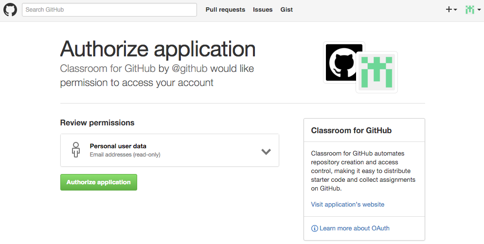
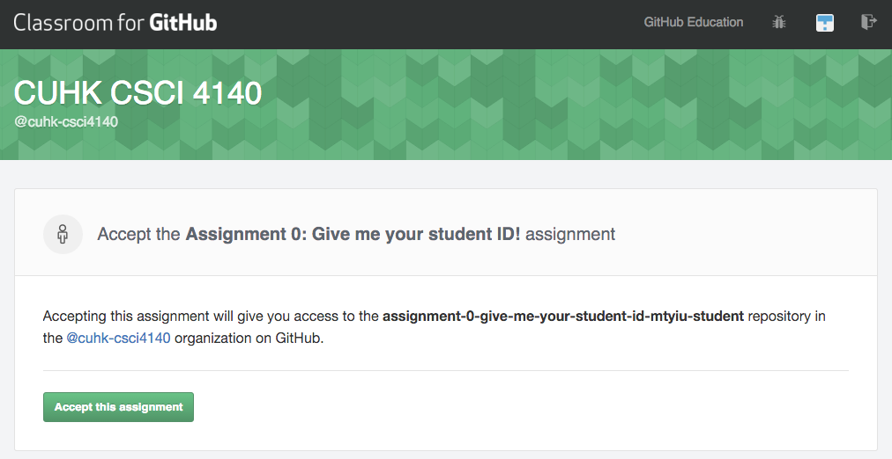
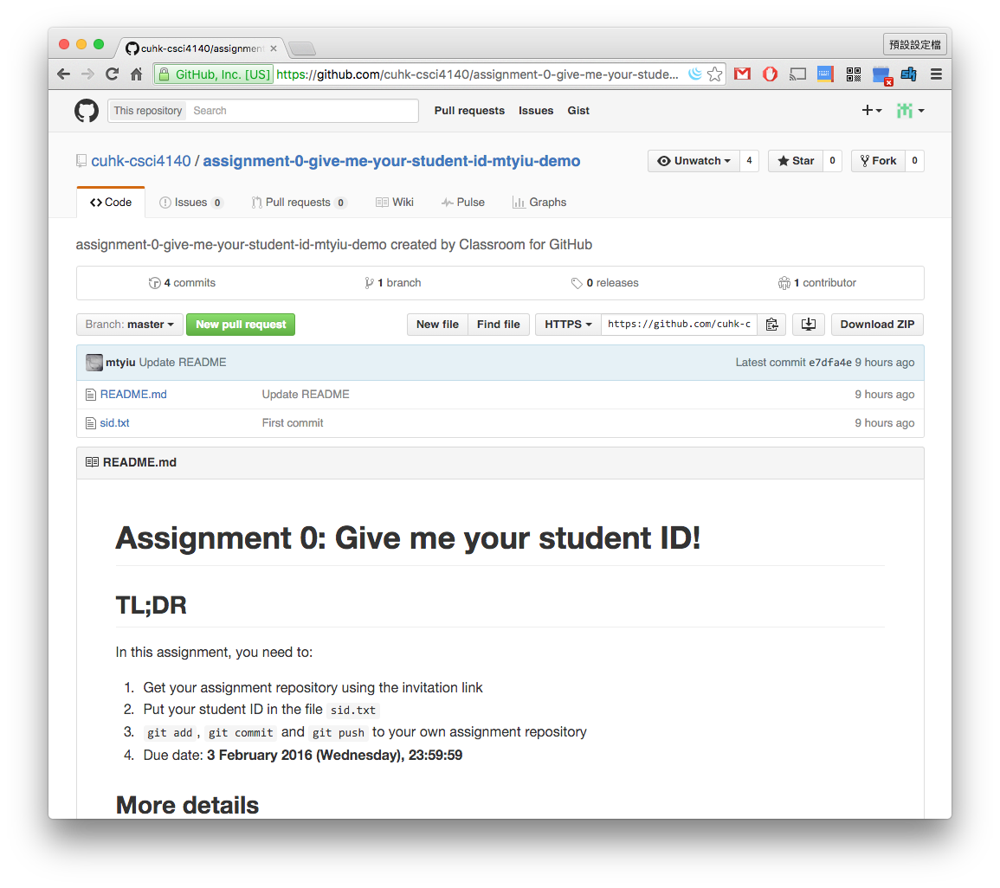
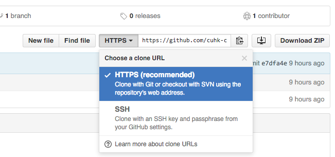
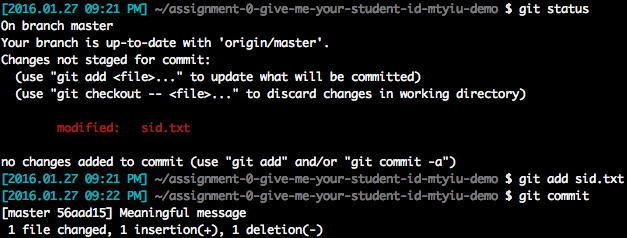
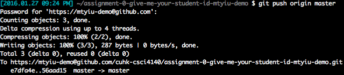

# CSCI 4140 Tutorial 2: Git Lab

## Prerequisites

To finish this lab, you need to

- Register a [GitHub](https://www.github.com/) account
- Install `git` on your Mac OS X / Linux / Windows computer

Let's get started with our first assignment, **Assignment 0: Give me your student ID!**

## Work on your repository

We will use [Classroom for GitHub](https://classroom.github.com/) to collect your assignment! The work flow of using it is a little bit different from the ordinary GitHub work flow. Let's experience it together.

1. For each assignment, we will send you an email with an **invitation link**. The invitation link for Assignment 1 will be shown during the tutorial. For those who did not come to the tutorial, we will send the link to your CUHK @Link mail box.

2. Visit the invitation link. You will be asked to authorize the application. Click "Authorize application".

	

3. You will then be asked to accept this assignment. Click "Accept this assignment".

	

4. You are ready to go! Your repository for your assignment is created.

	

## Clone your repository

I prepare a starter code for this assignment, which includes two files: `README.md` and `sid.txt`. Your job is to put your student ID in `sid.txt`, then commit and push the change. Let's see how to do it.

1. Clone your repository to your own computer. First get your clone URL from the repository page. If you are familiar with SSH key and passpharse, choose "SSH"; otherwise, please use "HTTPS" (which requires less set-up). Copy the clone URL.

	**Important.** If you use HTTPS as the clone URL, you need to include your user name in the URL when you run `git clone` so that you can push to this repository later. For example, if your clone URL is `https://github.com/mtyiu/csci4140.git`, then add your user name as follows:

		https://[YOUR_USERNAME]@github.com/mtyiu/csci4140.git

	

2. Open your terminal and type

		git clone [Your clone URL]

	**Note:** If you use our department Linux machine to clone the repository, you need to type `socksify` before the `git clone` command.

3. `cd` to the directory. You should see the two files `README.md` and `sid.txt`. Now use your favorite text editor to modify `sid.txt`. Replace its contents with your own student ID.

4. Type `git status`. You should see your "*uncommited*" changes here.

5. Type `git add sid.txt` to update what will be committed.

6. Type `git commit`. You will be asked to enter the commit message for your changes. Try to put something meaningful here.

	

7. Finally push your changes to GitHub using `git push origin master`. **This is the most important step for your assignment submission!**

	

8. Done! You can check your changes on GitHub.

**Note:** This lab is too simple for those who are already familiar with git. Yet, please finish this assignment because we need to know the mapping between your student ID and GitHub account...

---

Prepared by [Matt YIU Man Tung](http://mtyiu.github.io/)
